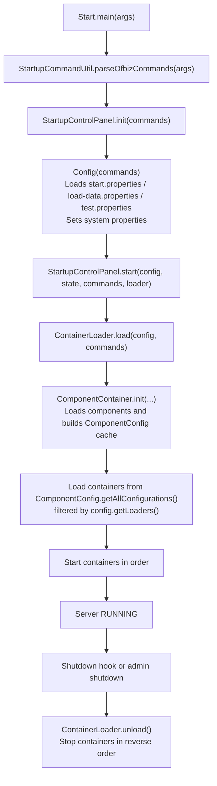

# Apache OFBiz Phase 1 — Execution and Boot Flow Analysis

## Boot lifecycle overview

Apache OFBiz boots through a structured sequence that converts command-line input into a configuration, loads component metadata, selects and starts runtime containers, and then remains running until shutdown.

The boot sequence is explicitly implemented as Java code and is driven by configuration files rather than hard-coded module lists. This section documents the flow based on `framework/start` and `framework/base` startup classes.

## Main entrypoint and command dispatch (`Start`)

The JVM entrypoint is `org.apache.ofbiz.base.start.Start`.

At startup, `Start.main(String[] args)` parses command line arguments into a list of startup commands, determines a command type (help, status, shutdown, or start), and then delegates to the startup control panel.

If the command is `START`, the control panel’s `start(...)` method is invoked with:

- the resolved startup configuration (`Config`)
- the server state machine (`AtomicReference<ServerState>`)
- the parsed startup commands
- a `ContainerLoader` instance

This design makes the boot process deterministic and centralizes the critical logic in a small number of classes.

## Startup configuration loading (`Config`)

`org.apache.ofbiz.base.start.Config` encapsulates boot parameters used during startup.

A key design decision is that `Config` chooses which properties file to load based on the startup command list:

- `load-data.properties` if the “load data” option is used
- `test.properties` if the “test” option is used
- `start.properties` otherwise

These property files are loaded from the classpath under `org/apache/ofbiz/base/start/`.

Once loaded, the configuration object sets:

The `ofbiz.home` directory, which becomes a system property and is the basis for component location resolution and many file-based behaviors.

Administrative host/port/key settings for management operations.

A list of “loaders” from the `ofbiz.start.loaders` property. These loader names are used later to decide which containers should start.

The log directory location and whether to auto-shutdown after loading.

Default JVM locale and timezone.

Because `Config` sets `ofbiz.home` and other system properties, the boot order is important: components and containers that use `ofbiz.home` assume it exists as a system property by the time they initialize.

## Startup control panel responsibilities (`StartupControlPanel`)

`StartupControlPanel.start(...)` performs a few critical boot activities:

It ensures the log directory exists.

It conditionally registers a JVM shutdown hook that will invoke `shutdownServer(...)`. This hook is controlled by `ofbiz.enable.hook`.

It calls `loadContainers(...)`, which delegates container initialization and start to `ContainerLoader.load(...)`.

If `ofbiz.auto.shutdown` is enabled, the system will load containers and then stop them immediately, terminating the process. Otherwise, it prints a standard startup banner and remains running.

This structure supports multiple operating modes: normal long-running server mode, a “load and exit” mode useful for initialization tasks, and administrative modes like status/shutdown requests.

## Container loading and start (`ContainerLoader`)

`org.apache.ofbiz.base.container.ContainerLoader` is responsible for converting the loaded component metadata into concrete running container instances.

The core boot sequence in `ContainerLoader.load(...)` is:

First, it creates and initializes a mandatory `ComponentContainer` with the container name `component-container`. This step is mandatory because it loads component classpaths and component descriptors before any other container starts.

Second, it loads additional containers defined across all components by calling `loadContainersFromConfigurations(...)`. This method iterates over all container configuration blocks discovered by `ComponentConfig.getAllConfigurations()`.

Third, it starts each loaded container in order. If any container fails to start, boot fails by throwing a `StartupException`.

On shutdown, `ContainerLoader.unload()` stops containers in reverse order using a descending iterator. This is important because it respects the implicit dependency order: later-started containers often depend on earlier-started containers.

## How OFBiz chooses which containers to start

The container selection logic is configuration-driven.

Each component can define one or more `<container>` blocks in its `ofbiz-component.xml`. Those container definitions can specify a `loaders` attribute, which is a comma-separated list of loader names that should cause the container to be activated.

At runtime, `ContainerLoader.loadContainersFromConfigurations(...)` checks whether the container’s configured loader names intersect with the loader list in `Config.getLoaders()`.

If the two sets intersect (or are both empty), the container is loaded and later started.

This design has two enterprise-friendly properties:

It allows a single distribution to support multiple runtime profiles (for example, a minimal profile vs. a full profile), because the loader list can be swapped by changing properties rather than changing code.

It allows components to contribute runtime processes without central registration, because each component declares its own containers and those containers are discovered automatically once components are loaded.

## Component loading is a first-class boot step (`ComponentContainer`)

The `ComponentContainer` exists specifically to load components and build up the in-memory component configuration cache.

It relies on `ComponentLoaderConfig.getRootComponents()`, which reads `component-load.xml` from the classpath. In this repository, the root component loader file is `framework/base/config/component-load.xml`, and it establishes which parent directories contain components.

Once root component directories are known, `ComponentContainer` loads each component definition (either a single component or a component directory) and reads `ofbiz-component.xml` files to populate `ComponentConfig` instances. After loading all components, it calls `ComponentConfig.sortDependencies()` to ensure the component registry is dependency-ordered.

This is the key reason `ComponentContainer` must be the first container: every other container depends, directly or indirectly, on the component registry for locating resources, services, entities, and container configs.

## High-level boot flow diagram

## Typical boot failure points (static analysis)

Even without running the system, the boot flow suggests a few high-probability failure points in real deployments:

If the startup property file cannot be found or read, `Config` construction fails early. Because OFBiz expects those files on the classpath, packaging errors can prevent boot entirely.

If components are misconfigured (missing `ofbiz-component.xml`, invalid classpath entries, invalid dependency cycles), component loading or dependency sorting will fail, and boot will not progress to container startup.

If the selected container set includes containers that require external services (for example, a database), those containers may fail to initialize or start depending on configuration and availability.

Because container selection is loader-driven, a wrong `ofbiz.start.loaders` configuration can lead to missing critical containers (resulting in a “running” process that does not actually provide expected capabilities), or it can start too many containers (resulting in configuration conflicts, port binding failures, or unnecessary resource load).

Task completed: Added Phase 1 execution and boot flow analysis document.
