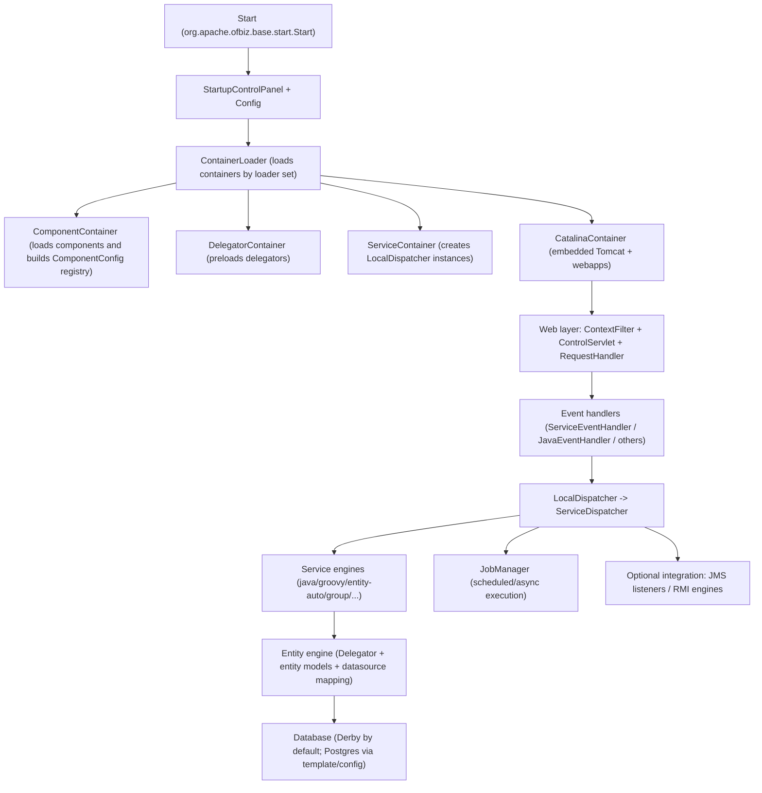

# Apache OFBiz — High-Level Design (HLD)

## Context

Apache OFBiz is a component-driven ERP and e-commerce framework. In this workspace, OFBiz is analyzed as a large enterprise system with a configuration-driven runtime and a strong separation between:

1. A web control layer that routes HTTP requests using controller configuration,
2. A service engine that executes named business services (sync/async) with transaction and security boundaries, and
3. An entity engine that provides declarative entity models, data-source routing via delegators, and persistence hooks.

This document is derived from Phase 1 analysis in `docs/analysis/` and corroborated by key runtime sources in the OFBiz repository.

## System goals and architectural drivers

OFBiz’s architecture is shaped by a few major drivers that are visible in the codebase.

OFBiz must support large business domains (ERP and e-commerce) while keeping customizations and extensions isolated. It accomplishes this through a component system where each component contributes entities, services, web applications, and container definitions.

OFBiz must standardize business logic execution. It accomplishes this through a named service model with declarative definitions, a dispatcher abstraction, multiple execution engines (Java, Groovy, entity-auto, group orchestration), and shared transaction/auth/validation behavior.

OFBiz must support multiple deployment profiles. It accomplishes this through “loaders” (for example `main`, `load-data`, and `test`) that select which containers start.

## Architectural overview

At runtime, OFBiz starts from a single JVM entry point and then loads and starts a set of “containers” (background processes). Containers host and initialize the major runtime subsystems (component loading, embedded Tomcat, service engine dispatchers, entity engine delegators, and more).

The most important “boundary” is that components declare what they contribute (services, entities, webapps, containers) and the runtime assembles these contributions based on loader configuration.

### High-level runtime structure

## Core subsystems

### Component system (modularity boundary)

OFBiz uses a component descriptor (`ofbiz-component.xml`) as the unit of modularity. Components are discovered from parent directories defined by `framework/base/config/component-load.xml` and are also used as a build-time inclusion mechanism (Gradle dynamically includes enabled components).

From the runtime’s perspective, components matter because they provide:

1. Entity resources (models, ECA rules, seed/demo data),
2. Service resources (service models, service ECA rules, and service groups),
3. Web applications (mount points, permissions, and locations), and
4. Container definitions (what background processes can be started).

### Container system (runtime assembly boundary)

OFBiz starts containers based on the loader set from startup configuration. Each container is a class implementing `org.apache.ofbiz.base.container.Container` and is instantiated from the class name declared in component configuration.

The `ContainerLoader` always loads the component container first, then loads additional containers contributed by components whose configured loader sets intersect with the configured runtime loader list.

### Web control system (HTTP boundary)

When running with the embedded Tomcat container, incoming HTTP requests flow through OFBiz’s servlet and filter chain. OFBiz’s web layer sets up `delegator`, `dispatcher`, and `security` objects in the request and session, then passes the request to a request handler that resolves a controller configuration and executes events and view rendering.

The routing configuration is controller-driven (via `controller.xml` files per webapp). Events can invoke services or static Java methods, among other patterns.

### Service engine (business logic boundary)

OFBiz’s service engine is built around named services. A service is executed through a dispatcher, which delegates to a global `ServiceDispatcher`. Execution includes authentication, permission checks, input validation, transaction boundary management, ECA hook execution, engine invocation (Java, Groovy, group, etc.), and optional output validation.

The service engine is configured by `framework/service/config/serviceengine.xml`, which defines engines (such as `java`, `groovy`, `entity-auto`, and `group`) and thread pool configuration used by job polling and asynchronous execution.

### Entity engine (persistence boundary)

OFBiz’s entity engine uses a `Delegator` abstraction configured by `entityengine.xml`. Delegators map entity groups to datasources. Datasources can be configured to check and/or evolve schema on startup (for example with `check-on-start` and `add-missing-on-start`).

Multi-tenancy support is built into the web layer and dispatcher naming conventions. When tenant mode is enabled, the web layer can select a tenant-specific delegator name and thereby select a tenant-specific dispatcher and datasource behavior.

## Cross-cutting concerns

### Transaction management

Both the web event layer and the service engine manage transactions. In the web control layer, the Java event handler begins and commits a transaction around the event method call. In the service engine, `ServiceDispatcher` handles transaction begin/suspend/resume, retries on deadlocks, commit/rollback, and related concerns.

### Security

Security is present both at the HTTP layer and at the service boundary. The service engine determines whether a service requires auth, checks for a login context (`userLogin`), and evaluates service permissions. The web layer populates security objects into request/session scope for event and view logic.

### Observability

The web control layer includes request/visit tracking (for example `ServerHitBin` and `VisitHandler`). The service engine maintains a bounded in-memory “running service log” and includes timing and slow-service logging thresholds.

## Extension philosophy (what “safe change” looks like)

OFBiz is designed to be extended through configuration and component contributions rather than by modifying core framework code. The primary extension surfaces are:

1. New components with their own `ofbiz-component.xml`,
2. New service definitions (and implementations) using existing engine types,
3. New entity models using `<extend-entity>` and component entity resources, and
4. Webapp/controller changes scoped to a component’s webapp and widget definitions.

This is why enterprise customization typically occurs by adding new components or augmenting existing application components, rather than editing framework internals.

## References

For deeper analysis detail, see Phase 1 documents in `docs/analysis/`, especially the service architecture and boot flow analyses.
