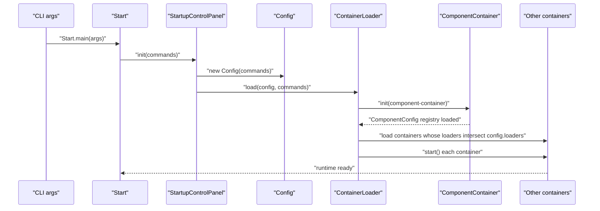
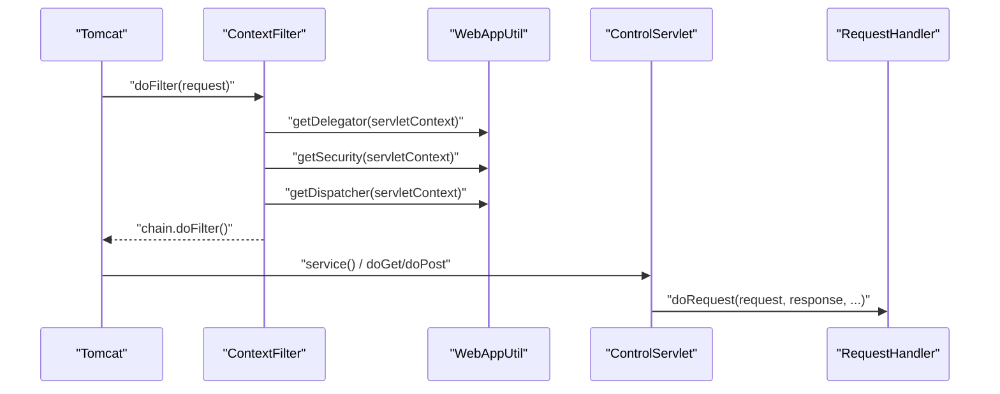
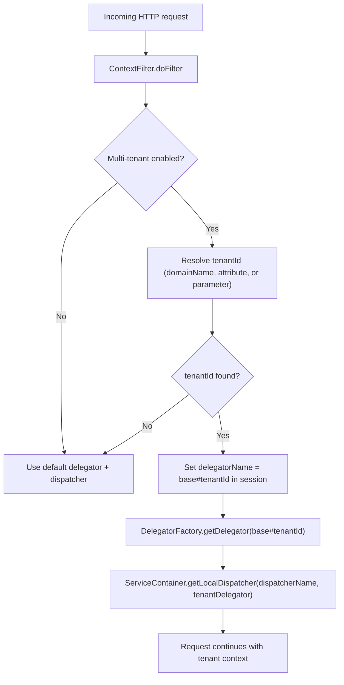
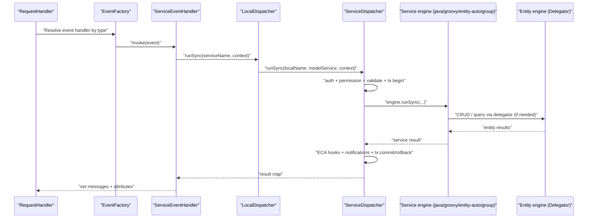
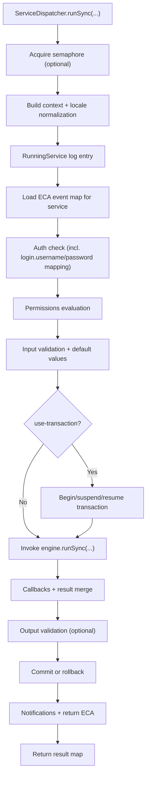

# Apache OFBiz — Component Interaction Flows

## Purpose

This document captures the most important runtime interaction flows in OFBiz, expressed as:

1. A narrative describing what happens and why it matters, and
2. Mermaid sequence/flow diagrams that are suitable for enterprise architecture review.

The flows here are derived from Phase 1 analysis and corroborated by the OFBiz startup, container, web control, and service engine sources.

## Flow 1: Startup and container activation

OFBiz boots by converting startup commands into a runtime configuration (`Config`) and then loading containers. Containers are started based on the loader list from startup properties, which acts as a runtime profile mechanism.

## Flow 2: Webapp initialization and request entry

In a web deployment using the embedded Tomcat container (`CatalinaContainer`), a request is processed through filters and the main OFBiz control servlet.

Two concepts are important for understanding OFBiz request handling:

1. The web layer is responsible for ensuring `delegator`, `dispatcher`, and `security` are available in request/session context.
2. The core routing is controller-driven, meaning `controller.xml` request maps define which events run and which views are rendered.

## Flow 3: Multi-tenant selection at the HTTP boundary

When multi-tenant mode is enabled, the web layer may switch the delegator and dispatcher based on domain name or explicit tenant identifiers. This is significant because it changes both the persistence context and service dispatcher namespace.

## Flow 4: Controller event execution → service invocation

Controller events can call services directly. In this path, the service boundary becomes the functional boundary for the business operation, and the controller event is primarily responsible for mapping request values into the service’s expected parameter schema.

## Flow 5: Service engine sync execution (transaction + ECA semantics)

The service engine enforces consistent enterprise behavior: it can acquire semaphores, manage transactions, execute ECA hooks at multiple phases, invoke the actual engine implementation, and validate outputs.

The key insight is that even when business logic is implemented in different ways (Java, Groovy, entity-auto, group), the same outer execution pipeline is applied by `ServiceDispatcher`.

## Notes for architects and implementers

The flows above show why OFBiz is often described as configuration-driven and service-oriented. Most enterprise behaviors (routing, authorization, validation, transactional integrity, orchestration composition) are applied by the framework’s control plane and execution pipeline rather than being duplicated in each business module.

For customizations, the safest strategy is to extend through component-contributed services, entities, and webapps so the same pipelines continue to apply consistently.
