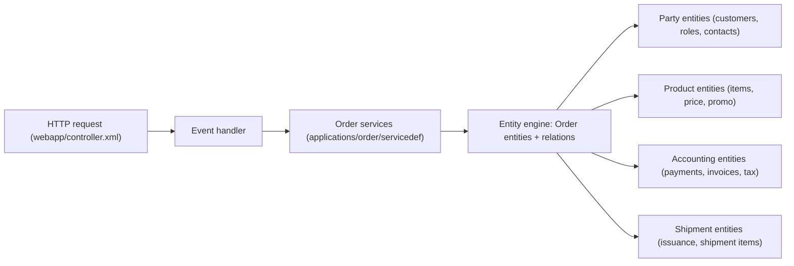

# Apache OFBiz — E-commerce and ERP Workflows

## Purpose

This document provides an enterprise-oriented explanation of how OFBiz executes common e-commerce and ERP workflows using:

1. Controller-driven web request routing,
2. Named services as the primary business logic interface, and
3. Entity models (via delegators) for persistence and cross-domain relationships.

The goal is not to describe every OFBiz feature, but to explain the “shape” of workflows in a way that aligns with the codebase’s actual architecture.

## Architectural premise: workflows are service-centric

In OFBiz, a workflow is typically not a single monolithic function. Instead, workflows are composed of:

HTTP requests routed through `controller.xml` request maps, which invoke events.

Events that either call services (`ServiceEventHandler`) or invoke static Java event methods (`JavaEventHandler`), often acting as the boundary between UI and backend logic.

Named services executed through a dispatcher and the service engine, with consistent enterprise behavior (auth, permission checks, validation, transaction control, and ECA hooks).

Entity operations executed through `Delegator`, which enforces the entity model and datasource mapping.

This architecture is why OFBiz workflows are often described as “configuration-driven and service-oriented.”

## E-commerce workflow: browse → cart → checkout → order

### Browse and catalog exploration

The product component (`applications/product`) provides catalog and facility webapps. These webapps route requests through the control servlet and request handler, and they invoke service-backed events to retrieve and render catalog/category/product data.

Even when a screen renders data, the typical “business read” boundary is an entity query or a service that wraps entity queries, ensuring consistent permission and validation behavior.

### Add to cart and cart management

Cart behavior is owned by the order component (`applications/order`) and is implemented through services declared in files like `servicedef/services_cart.xml`. Requests in the order manager or storefront webapps typically map “add/update cart” actions to service events, resulting in service calls that update session/cart state and persist relevant changes when needed.

### Checkout and order creation

Checkout behaviors are defined by services declared in `servicedef/services_checkout.xml` and related order service definitions. The service layer is responsible for transactional integrity around order creation: creating the order header and order items, applying adjustments, and ensuring cross-entity consistency.

Because service execution uses `ServiceDispatcher.runSync`, checkout services can run within a single transaction and can trigger ECA rules before/after key phases (auth, validate, invoke, commit, return). This is one of the core reasons OFBiz places “workflow seriousness” in services rather than in controllers.

### Order management and lifecycle

Once an order exists, order management workflows operate through services declared in `services_order.xml`, `services_return.xml`, and related definition files. These services manipulate entities representing orders, statuses, adjustments, and relationships to other domains (shipment, accounting, party).

The order manager webapp (`/ordermgr`) is a concrete UI entry point for these workflows.

### A “workflow cross-domain” view

This diagram reflects how OFBiz “order” workflows are inherently cross-domain in an ERP-style system.

## ERP workflow: accounting and financial processing

### Accounting entry points

Accounting capabilities are provided by the accounting component (`applications/accounting`) and exposed via multiple webapps:

- `/accounting` for general accounting,
- `/ar` for accounts receivable,
- `/ap` for accounts payable.

These webapps invoke services declared in accounting service definition files (for example `services_invoice.xml`, `services_payment.xml`, and `services_ledger.xml`).

### Typical accounting subflows

Invoice creation and update is service-driven and typically results in entity changes that create or update invoice headers, items, and status transitions.

Payments and allocations are also service-driven. Payment services often interact with other domains (orders, invoices, parties) because payments reference who paid, what was paid, and how it was applied.

Ledger and GL processes are similarly service-driven and rely heavily on entity relationships that tie transactional documents (orders, invoices, payments) to accounting structures.

### Why service boundaries matter in ERP processing

ERP workflows generally require strict transactional integrity and consistent validation. In OFBiz, this is enforced by the service execution pipeline in `ServiceDispatcher`, which manages transaction begin/commit/rollback and supports “require new transaction” behavior for services that must isolate themselves.

Therefore, even when a workflow starts from UI actions, the enterprise boundary where correctness is enforced is the service engine.

## Multi-tenancy consideration (workflow isolation)

When multi-tenancy is enabled, the web layer can select a tenant-specific delegator and dispatcher. This affects workflows in a predictable way:

Entity operations and service executions become tenant-scoped via `delegatorName` and dispatcher naming conventions.

This allows the same workflow definitions (services, entities, controllers) to execute against tenant-specific datasources and configuration, provided the deployment is configured appropriately.

## Summary

OFBiz workflows in this repository should be understood as:

1. Controller-driven routing at the HTTP layer,
2. Service-centric orchestration and enforcement of enterprise semantics, and
3. Entity-model-driven persistence with cross-domain relationships.

For engineering work, the most stable and enterprise-aligned workflow extension point is the service layer, because it is where authorization, validation, transactions, and ECAs converge.
